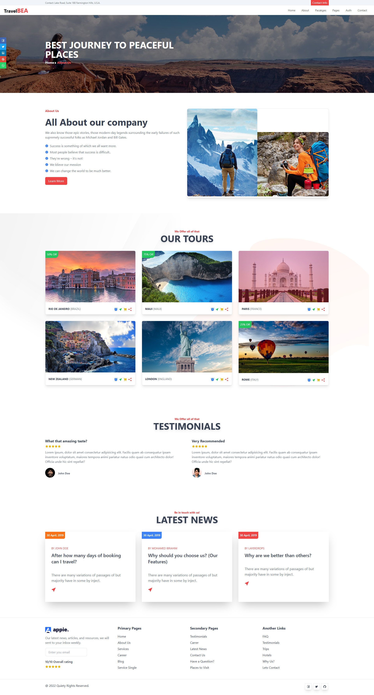
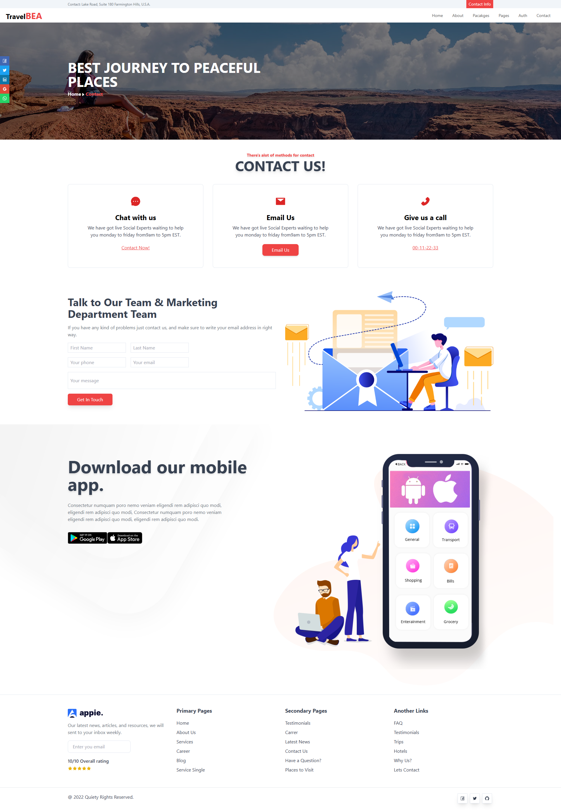
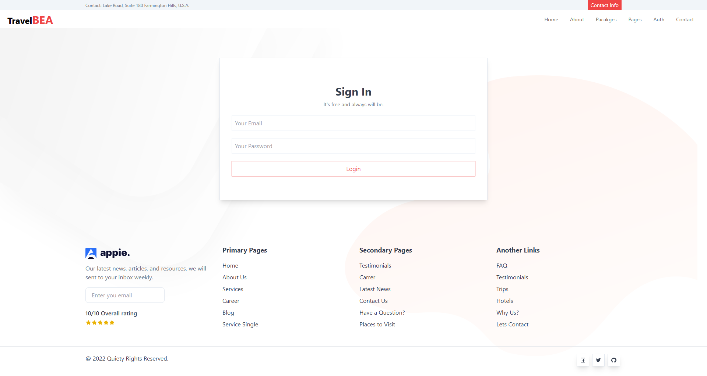

# Next Travel Website With Next & TailiwndCSS.

A modern, fully responsive Travel Website built using Next.js, designed to help users explore destinations, book trips, and find travel inspiration.

## Live demo

Check the live demo here 👉️ [Take a look](https://next-travel-beta.vercel.app//)

## Features 🌟

- **Built with Next.js**: A React-based framework for fast, server-side rendering, and static site generation.
- **Styled with TailwindCSS**: A utility-first CSS framework for fast and responsive design.
- **20+ Pages**: A variety of pages including:
  - Homepage with featured cities and packages 🌏
  - City details page 🏙️
  - Travel packages listings 🧳
  - User login and registration forms 🔐
  - Dynamic, SEO-friendly URLs for each destination and package.
- **Responsive Design**: Optimized for desktop, tablet, and mobile views 📱💻
- **Smooth Navigation**: Easy-to-use navigation between pages with dynamic routing.

## Technologies Used 🌟

- **Next.js**: For server-side rendering and page routing.
- **TailwindCSS**: For utility-first CSS styling.
- **React.js**: The core JavaScript library for building user interfaces.
- **React Icons**: For adding icons throughout the UI.
- **Next Image**: For optimized image rendering, improving page load times.

## Screenshots 🖼️

Below are some screenshots of the platform:

### Homepage


### About Us Page



### Contact Us Page



### Auth Page



### Packages Page


## Installation ⚙️

### Steps to Install

1. **Clone the repository**:

   ```bash
   https://github.com/MuaviyaImran/travel-react.git
   cd next-travel
   ```

2. **Install dependencies**:

   ```bash
   npm install
   ```

3. **Run the application:**

   ```bash
   npm run dev
   ```

4. Open your browser and go to http://localhost:3000 to view the application.

## License 🤝

This project is licensed under the MIT License - see the LICENSE file for details.

## Acknowledgments 🙏

Thanks to the creators of Next.js and Tailwind CSS, which made the development process fast and efficient. 🌟

Special thanks to all the open-source libraries and components used to build a modern and responsive user interface.
Contact 🌐

## Contact 📧

For any questions or feedback, feel free to reach out:

**Email: muaviyaimran1122@gmail.com**

**GitHub: [@MuaviyaImran](https://github.com/MuaviyaImran)**
